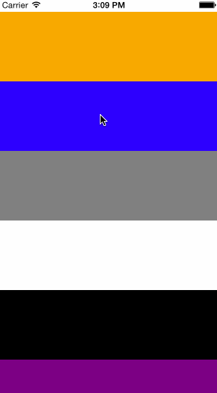

# RCTRefreshControl

A pull to refresh control for react native.



## Installation

1. Run `npm install react-refresh-control --save`.
2. Open your project in Xcode, right click on `Libraries` and click `Add Files to "Your Project Name"` then choose the `RCTAnimationExperimental.xcodeproj`.
3. Add `libRCTAnimationExperimental.a` to `Build Phases -> Link Binary With Libraries`.
4. Add `var RefreshControl = require('react-refresh-control');` to your code.
5. Add `mixins: [RefreshControl.Mixin]` to your code.

## Usage for ScrollView

```javascript
'use strict';

var React = require('react-native');
var TimerMixin = require('react-timer-mixin');
var RefreshControl = require('react-refresh-control');
var {
  AppRegistry,
  ScrollView,
  StyleSheet,
  Text,
  View,
} = React;

var AwesomeProject = React.createClass({
  mixins: [TimerMixin, RefreshControl.Mixin],
  componentDidMount: function() {
    this.configureRefreshControl({
      beginRefreshing: () => {
        this.setTimeout(() => {
          this.endRefreshing();
        }, 3000);
      }
    });
  },
  render: function() {
    return (
      <ScrollView style={{marginTop: 20}} {...this.refreshControlProps()}>
        {this.refreshControl()}
        <View style={{backgroundColor: 'orange', height: 100}} />
        <View style={{backgroundColor: 'blue', height: 100}} />
        <View style={{backgroundColor: 'gray', height: 100}} />
        <View style={{backgroundColor: 'white', height: 100}} />
        <View style={{backgroundColor: 'black', height: 100}} />
        <View style={{backgroundColor: 'purple', height: 100}} />
      </ScrollView>
    );
  }
});

AppRegistry.registerComponent('AwesomeProject', () => AwesomeProject);
```

## Usage for ListView

```javascript
'use strict';

var React = require('react-native');
var TimerMixin = require('react-timer-mixin');
var RefreshControl = require('react-refresh-control');
var {
  AppRegistry,
  ListView,
  StyleSheet,
  Text,
  View,
} = React;

var AwesomeProject = React.createClass({
  mixins: [TimerMixin, RefreshControl.Mixin],
  getInitialState: function() {
    var ds = new ListView.DataSource({rowHasChanged: (r1, r2) => r1 !== r2});
    return {
      dataSource: ds.cloneWithRows(['row 1', 'row 2']),
    };
  },
  componentDidMount: function() {
    this.configureRefreshControl({
      beginRefreshing: () => {
        this.setTimeout(() => {
          this.endRefreshing();
        }, 3000);
      }
    });
  },
  render: function() {
    return (
      <ListView
        style={{marginTop: 20}}
        dataSource={this.state.dataSource}
        renderRow={(rowData) => <Text>{rowData}</Text>}
        renderHeader={this.refreshControl}
        {...this.refreshControlProps()}
      />
    );
  }
});

AppRegistry.registerComponent('AwesomeProject', () => AwesomeProject);
```

## Configure

The following configs are used:

```javascript
this.configureRefreshControl({
  pullToRefreshText: 'Pull down',
  releaseToRefreshingText: 'Release',
  refreshingText: 'Loading...',  
  beginRefreshing: () => {}
});
```

---

## License

Available under the MIT license. See the LICENSE file for more informatiion.
